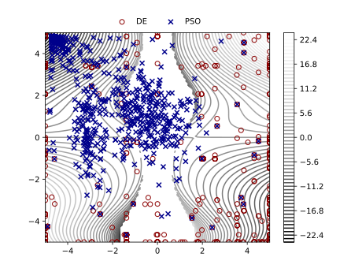

# Evolutionary Competition

> compete the "evolution" and evolve the "competition"

## Generating Benchmark by GP

Generate benchmark functions to differ a pair of evolutionary algorithms based on genetic programming algorithm

### Requirements

- Python 3.9
- deap
- scipy
- matplotlib

### Usage

See `example.py`

Check the following functions generated by GP!

$$\frac{\cos{x}}{x-y-\cos{5}}$$

$$-(y+xy+\sin(\sin{y}))$$

$$\frac{6xy^2\log(\cos\frac{y}{8})(\frac{x}{9}-\sin{x})}{\cos(\sin(\sin{x})(\frac{2}{7+y}))}$$

$$\sin(7)xy\log(\log{x^2}-\sin{y})$$

### Evolutionary Algorithms

- random search
- differential evolution
- particle swarm optimization
- cuckoo search

### Distance Metrics

- wasserstein distance

## Todo

- [ ] write README file
- [ ] check high dimension cases
- [ ] add multiprocessing
- [ ] implement map-elite gp
- [ ] add more eas
- [ ] add new metrics
