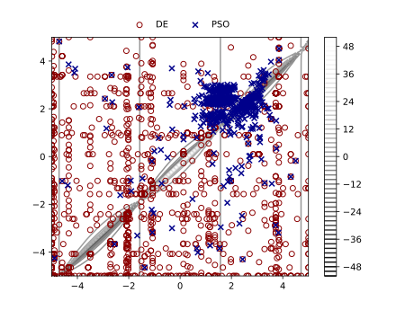

# Evolutionary Competition

> compete the "evolution" and evolve the "competition"!

## Generating Benchmark by GP

Generate benchmark functions to differ a pair of evolutionary algorithms based on genetic programming algorithm.

<p align="center"></p>

### Requirements

- Python 3.9 (tested, other version should also work)
- deap
- scipy
- matplotlib
- pygraphviz

### Installation

Install Python and [Graphviz](https://graphviz.org/), then install the library in this repo.

```bash
pip install git+https://github.com/Y1fanHE/evolutionary-competition.git
```

### Usage

Create a tuple for DE.

```python
from evocomp.evo import de_rand_1_bin

de = (
    de_rand_1_bin,                # de
    dict(n_eval = 2000,           # parameters
         n_pop  = 20,
         F      = 0.5,
         CR     = 0.5),
    "DE"                          # alias
)
```

Create a tuple for PSO.

```python
from evocomp.evo import particle_swarm_optimization

pso = (
    particle_swarm_optimization,  # pso
    dict(n_eval = 2000,           # parameters
         n_pop  = 20,
         w1     = 0.5,
         w2     = 0.5,
         c      = 0.1),
    "PSO"                         # alias
)
```

Create a `Competition` using `wasserstein_distance`.

```python
from evocomp.comp import Competition
from evocomp.comp.metrics import wasserstein_distance

comp = Competition(
    metric      = wasserstein_distance, # distance metric
    algorithm1  = de,                   # two eas
    algorithm2  = pso,
    lower_bound = -5,                   # bounds of search space
    upper_bound = 5,
    dimension   = 2,                    # dimension of search space
    repetition  = 1,                    # repetition of ea runs
    mode        = "differ"              # mode: differ/match
)
```

Evolve the `Competition` by `simple` EA.

```python
from evocomp.comp.gp import simple

comp.evolve(                            # gp parameters
    method          = simple,
    population_size = 10,
    max_generation  = 6,
    tournament_size = 7,
    crossover_rate  = 0.8,
    mutation_rate   = 0.1,
    seed            = 1000,
    verbose         = True
)
```

Plot the results.

```python
comp.plot_space(target="out.png")       # contor plot
comp.plot_tree(target="out_tree.png")   # tree plot
comp.save(target="out.sol")             # text file
```

Also see `example.py` for a multiprocessing example.

```python
python -W ignore example.py
```

### The Generated Benchmark Functions

Check the following functions generated by GP!

$$\frac{\cos{x}}{x-y-\cos{5}}$$

<p align="center"></p>

$$-(y+xy+\sin(\sin{y}))$$

<p align="center"></p>

$$\frac{6xy^2\log(\cos\frac{y}{8})(\frac{x}{9}-\sin{x})}{\cos(\sin(\sin{x})(\frac{2}{7+y}))}$$

<p align="center"></p>

$$\sin(7)xy\log(\log{x^2}-\sin{y})$$

<p align="center"></p>

### Evolutionary Algorithms

- random search
- differential evolution
- particle swarm optimization
- cuckoo search

### Distance Metrics

- wasserstein distance

## Todo

- [x] write README file
- [ ] check high dimension cases
- [x] add multiprocessing
- [ ] implement map-elite gp
- [ ] add more eas
- [ ] add new metrics
